= Trabalho - Unidade I

:toclevels: 3
:toc: left
:source-highlighter: highlight.js
:imagesdir: ./img
:stem: latexmath <1>

Autor: Ítalo Maciel de Paiva

Instituição: Universidade Federal do Rio Grande do Norte

Curso: Engenharia da Computação

Orientador: Agostinho Júnior

Data: 22/10/2025

== Introdução

Este relatório apresenta a resolução dos desafios propostos pelo orientador ao final de cada capítulo da Unidade I da disciplina de Processamento Digital de Imagens. Os objetivos incluem:

* Resolver os problemas apresentados;
* Realizar discussões sobre os temas relacionados a cada questão;
* Analisar os resultados obtidos;
* Explorar novas ferramentas que contribuam para o conhecimento e para o desenvolvimento do currículo.

== Ferramentas Utilizadas

Para a execução das atividades, foram empregadas as seguintes ferramentas:

* *OpenCV* — para manipulação de imagens e vídeos;
* *asciidoc* — utilizado para a criação deste documento de registro das atividades;
* *makefile* — para a compilação e execução dos scripts;
* *C* — linguagem predominante para a implementação das soluções.

== Metodologia

A resolução dos desafios foi realizada seguindo os seguintes passos:

1. Leitura e interpretação do enunciado de cada desafio;
2. Planejamento da solução utilizando *C* e bibliotecas auxiliares;
3. Implementação do código e teste de resultados;
4. Análise crítica dos resultados obtidos;
5. Registro das conclusões no documento utilizando *asciidoc*.

== Parte I - Representação de Imagens

== Manipulação de pixels em uma imagem

=== Enunciado

*Utilizando o programa da Listagem 4, pixels.cpp, como referência, implemente um programa regions.cpp.* 
*Esse programa deverá solicitar ao usuário as coordenadas de dois pontos P1 e P2 localizados dentro dos limites do tamanho da imagem fornecida.* 
*A região definida pelo retângulo de vértices opostos definidos pelos pontos P1 e P2 será exibida com o negativo da imagem na região correspondente.*
*O efeito é ilustrado na Figura 4, "Exemplo de saída do programa *regions.cpp*".*

=== Resumo do Programa

O programa realiza as seguintes etapas principais:

1. **Carregamento da imagem**  
   A imagem é carregada usando *OpenCV* (`cv::imread`). Caso a imagem não seja encontrada, o programa lança uma exceção.

2. **Entrada de coordenadas pelo usuário**  
   O usuário insere os pontos P1 e P2, que definem a região do retângulo a ser processado.

3. **Validação das coordenadas**  
   A função `getPixelSafe` verifica se as coordenadas fornecidas estão dentro dos limites da imagem.  
   Se forem inválidas, é lançada a exceção `ImageException`.

4. **Aplicação do efeito negativo na região**  
   A função `negative_image` percorre cada pixel da região definida pelos pontos P1 e P2 e aplica a transformação negativa:

[source,c++]
----
for (int i = p1.getX(); i <= p2.getX(); i++) {
    for (int j = p1.getY(); j <= p2.getY(); j++) {
        pixel = image.at<cv::Vec3b>(i, j);
        pixel[0] = 255 - pixel[0];
        pixel[1] = 255 - pixel[1];
        pixel[2] = 255 - pixel[2];
        image.at<cv::Vec3b>(i, j) = pixel;
    }
}
----

5. **Exibição da imagem**  
   A imagem resultante é exibida em uma janela usando `cv::imshow`. O programa aguarda a tecla do usuário antes de encerrar.

=== Conceito do Efeito Negativo

O **efeito negativo** de uma imagem consiste em inverter as cores de cada pixel.  
Para cada canal de cor \(C\) (B, G, R), a transformação é dada pela equação:

[latex]
++++
C_{negativo} = 255 - C_{original}
++++

Onde:

* \(C_{original}\) é o valor do pixel no intervalo [0, 255]  
* \(C_{negativo}\) é o valor do pixel após a inversão  

O efeito faz com que cores claras se tornem escuras, cores escuras se tornem claras, e cada tonalidade seja invertida em relação ao valor máximo.

=== Instruções de Execução

1. Certifique-se de ter *OpenCV* instalado e configurado para compilação em *C++*.  
2. Compile o programa com o cmake:
4. Insira as coordenadas dos pontos P1 e P2 quando solicitado.

Figura abaixo mostra o efeito negativo aplicado na região da imagem definida pelos pontos P1 e P2:

== Tratando arquivos de vídeo

=== Enunciado

*Usando o programa video.cpp como referência, adapte-o para gravar o vídeo em tons de cinza. Mostre o resultado aplicado em algum arquivo de vídeo de sua escolha.*

*Usando o programa video.cpp como referência, adapte-o para gravar o vídeo aplicando o negativo aos quadros antes de enviá-los para o arquivo de saída. Mostre o resultado aplicado em algum arquivo de vídeo de sua escolha.*

== Resumo do programa

Este relatório analisa dois processos de manipulação de vídeo em C++ com OpenCV. Ambos os códigos leem um arquivo de vídeo, processam cada quadro (frame) e salvam o resultado, mas aplicam transformações visuais distintas: inversão de cores (negativo) e conversão para tons de cinza.

As seções a seguir detalham as partes essenciais do código responsáveis por cada uma dessas transformações.

== 1. Conversão para Vídeo Negativo

O objetivo deste processo é inverter completamente os valores de cor de cada quadro do vídeo. Onde era claro fica escuro, e onde era escuro fica claro.

=== Código-Chave (Negativo)

As partes cruciais do código são a inicialização do `VideoWriter` e o loop de processamento onde a transformação ocorre.

[source,cpp]
----
// ... (obtenção de largura, altura e fps) ...

// 1. Configuração do gravador de vídeo (para um vídeo colorido)
int codec = cv::VideoWriter::fourcc('M','J','P','G');
cv::VideoWriter out("output_negative.avi", codec, fps, frameSize, true); // <1>

// 2. Loop de processamento de frames
for(counter = 0; cap.read(frame); counter++){
    // 3. A transformação principal: bitwise_not
    cv::bitwise_not(frame, negativeFrame); // <2>
    
    // 4. Salva o frame processado
    out << negativeFrame;
    cv::imshow("Frame Negativo", negativeFrame);
    if(cv::waitKey(30) >= 0) break;
}
----

=== Explicação do Processo

A transformação em negativo é alcançada através de uma operação lógica bit-a-bit:

1.  **VideoWriter (Colorido)**: O `VideoWriter` é inicializado com o último parâmetro (isColor) definido como `true`. Isso é necessário porque a imagem negativa resultante ainda possui 3 canais de cor (BGR).

2.  **`cv::bitwise_not`**: Esta é a função central. Ela aplica uma operação **NOT** bitwise em cada pixel da imagem.
    * Em uma imagem de 8 bits (onde cada canal de cor vai de 0 a 255), essa operação inverte todos os bits.
    * Por exemplo, um pixel preto (`00000000`) torna-se branco (`11111111`, ou 255).
    * Um pixel branco (255) torna-se preto (0).
    * Um valor intermediário, como 100 (`01100100`), torna-se 155 (`10011011`).
    * Quando aplicado aos três canais (B, G, R) simultaneamente, o resultado é a inversão completa da cor (negativo fotográfico).

== 2. Conversão para Escala de Cinza

O objetivo deste processo é remover a informação de cor (croma) de cada quadro, mantendo apenas a informação de luminosidade (brilho).

=== Código-Chave (Escala de Cinza)

A mudança principal está na função de conversão usada no loop e na configuração do `VideoWriter`, que agora deve salvar um vídeo em preto e branco.

[source,cpp]
----
// ... (obtenção de largura, altura e fps) ...

// 1. Configuração do gravador de vídeo (para um vídeo não-colorido)
int codec = cv::VideoWriter::fourcc('M','J','P','G');
cv::VideoWriter out("output_gray.avi", codec, fps, frameSize, false); // <1>

// 2. Loop de processamento de frames
for(counter = 0; cap.read(frame); counter++){
    // 3. A transformação principal: cvtColor
    cv::cvtColor(frame, grayFrame, cv::COLOR_BGR2GRAY); // <2>
    
    // 4. Salva o frame processado
    out << grayFrame;
    cv::imshow("Frame em tons de cinza", grayFrame);
    if(cv::waitKey(30) >= 0) break;
}
----

=== Explicação do Processo

A conversão para escala de cinza é uma transformação de espaço de cores:

1.  **VideoWriter (Não-Colorido)**: O `VideoWriter` é inicializado com o parâmetro `isColor` definido como `false`. Isso informa ao codec que estamos salvando um vídeo de canal único (tons de cinza), o que economiza espaço e é o formato correto.

2.  **`cv::cvtColor`**: Esta é a função usada para todas as conversões de espaço de cor no OpenCV.
    * Nós passamos o `frame` original (que está em BGR - Blue, Green, Red) e pedimos ao OpenCV para convertê-lo para `grayFrame` usando o código de conversão `cv::COLOR_BGR2GRAY`.
    * A função aplica uma fórmula de luminância ponderada para calcular o valor de cinza de cada pixel (algo como `Cinza = 0.299*R + 0.587*G + 0.114*B`).
    * O resultado é uma imagem `grayFrame` que possui apenas um canal de cor (intensidade) em vez dos três originais.

== Visualização de imagens

=== Enunciado
*Utilizando o programa da Listagem 10, “visualizacao.cpp” como referência, prepare os arquivos matriz.txt e line.txt para as imagens sementes1.png e sementes2.png mostrada nas Figura 9, “Sementes 1” e Figura 10, “Sementes 2”. Utilize o programa gnuplot para realizar as visualizações mostradas nessa lição para ambas as imagens. Compare os gráficos gerados e discuta o que pode ser observado acerca da iluminação das cenas nas duas imagens.*

=== O que é um Histograma de Imagem

Um histograma de imagem é uma representação gráfica da distribuição de intensidades de pixel em uma imagem digital. Ele mostra, em forma de barras, a quantidade de pixels para cada nível de brilho, variando geralmente de 0 (preto) a 255 (branco) em imagens em escala de cinza.

Essa ferramenta é fundamental no processamento digital de imagens, pois permite:

- Avaliar o contraste da imagem.
- Identificar áreas superexpostas ou subexpostas.
- Guiar técnicas de realce, como equalização de histograma.
- Auxiliar na segmentação e na detecção de bordas.

Em imagens com boa distribuição de intensidade, o histograma tende a ocupar uma faixa ampla de valores. Já em imagens com iluminação desigual ou baixo contraste, o histograma pode se concentrar em uma faixa estreita, indicando perda de detalhes visuais.

=== Resumo do programa

Foram gerados os histogramas para duas imagens com pouca iluminação (sem flash) e com a iluminação melhorada (com flash), sendo essa última com objetivo de realçar os contornos dos objetos inseridos no espaço em branco. Os histogramas revelam diferenças significativas entre as duas imagens:

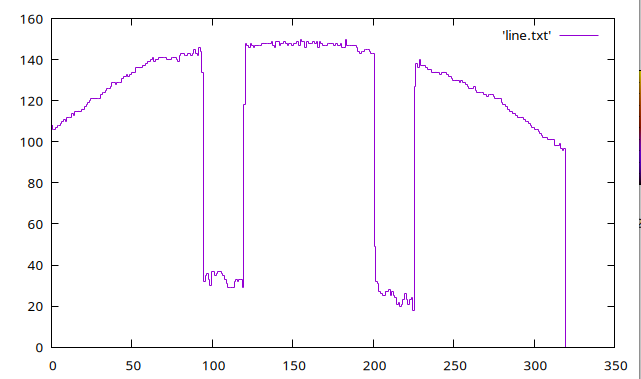
- *Imagem com flash*: apresenta distribuição concentrada em valores altos, indicando predominância de tons claros. O contraste é reduzido, o que suaviza os contornos e pode ocultar detalhes importantes.

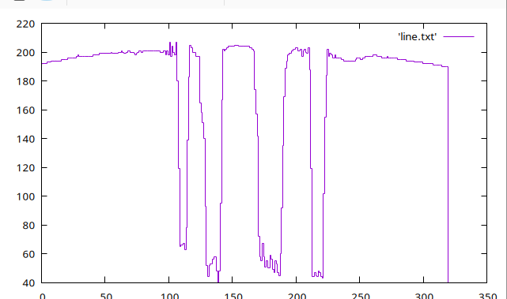
- *Imagem sem flash*: exibe uma distribuição mais ampla de intensidades, com presença marcante de tons escuros e médios. O contraste natural favorece a definição de bordas e texturas.

=== Visualizações 3D das Matrizes de Intensidade

As visualizações tridimensionais permitem observar a topografia da imagem em termos de brilho:

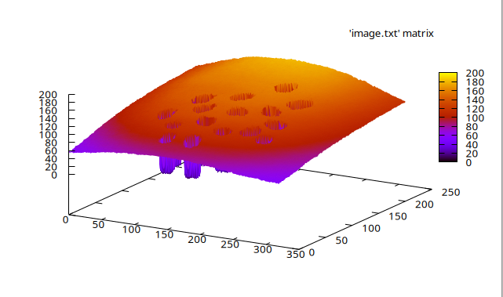
- *Imagem com flash*: a superfície é mais plana e elevada, com poucos vales. Isso indica uma iluminação uniforme que reduz variações locais.

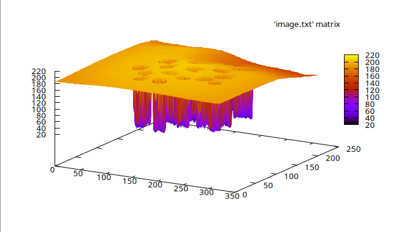
- *Imagem sem flash*: a superfície apresenta depressões e picos irregulares, evidenciando áreas de sombra e contorno. Essa variação é ideal para aplicações de segmentação e detecção de bordas.

A imagem com flash é útil para reconhecimento geral de formas em ambientes escuros, mas pode exigir técnicas de normalização para compensar saturações. Já a imagem sem flash é mais adequada para algoritmos de realce de bordas, como Sobel ou Canny, e para reconstrução de formas baseadas em variações de intensidade.

== Parte II - Processamento de Imagens Coloridas

=== Colorizando imagens cinzentas com mapas de cores

=== Enunciado
*Utilizando o programa da Listagem 19, “colormap.cpp” como referência, apresente a imagem com outros 5 colormaps disponíveis no OpenCV.*

=== O Significado da Cor no PDI

Em processamento digital de imagens, a cor não é apenas um elemento estético; ela é uma forma de representar dados. A maneira mais comum de representar cor é através do modelo **RGB** (Red, Green, Blue), onde cada pixel é descrito por três valores de intensidade, um para cada canal de cor.

Muitos algoritmos de PDI, no entanto, não precisam de informação de cor. Eles focam apenas na **luminosidade** (brilho) da imagem. Para isso, convertemos a imagem colorida (3 canais) para **tons de cinza** (1 canal). Isso simplifica a imagem e reduz o custo computacional de algoritmos (como detecção de bordas ou reconhecimento de formas).

O problema é que o olho humano é muito melhor para distinguir diferentes tonalidades de cor (azul, verde, vermelho) do que para diferenciar tons de cinza muito próximos.

Logo, os **mapas de cores**: eles são uma técnica para "re-colorir" uma imagem em tons de cinza. A imagem em si continua sendo de 1 canal, mas nós usamos uma paleta de cores (um "mapa") para *visualizar* seus valores de intensidade. Um valor de cinza 0 (preto) pode ser mapeado para azul (frio), e um valor 255 (branco) pode ser mapeado para vermelho (quente).

Isso é chamado de **pseudocor** (ou cor falsa) e é usado extensivamente em imagens térmicas, exames médicos (como ressonância magnética) e visualização de dados científicos, pois torna mudanças sutis de intensidade imediatamente óbvias.

=== Resumo do programa

O código a seguir carrega uma imagem, a converte para tons de cinza e, em seguida, aplica cinco mapas de cores diferentes a essa imagem de cinza para demonstrar o efeito da pseudocor.

[source,cpp]
----
#include <iostream>
#include <opencv2/opencv.hpp>
#include <vector>

int main(int argc, char** argv){
  cv::Mat image, gray;

  if(argc != 2){
    std::cerr << "Uso: " << argv[0] << " <Image_Path>\n";
    return -1;
  }

  image = cv::imread(argv[1], cv::IMREAD_COLOR);

  if (!image.data) {
    std::cerr << "Nao abriu " << argv[1] << std::endl;
    return -1;
  }

  cv::cvtColor(image, gray, cv::COLOR_BGR2GRAY);

  cv::Mat jet, hot, cool, ocean, magma;

  cv::applyColorMap(gray, jet,   cv::COLORMAP_JET);
  cv::applyColorMap(gray, hot,   cv::COLORMAP_HOT);
  cv::applyColorMap(gray, cool,  cv::COLORMAP_COOL);
  cv::applyColorMap(gray, ocean, cv::COLORMAP_OCEAN);
  cv::applyColorMap(gray, magma, cv::COLORMAP_MAGMA);

  cv::imshow("Original", image);
  cv::imshow("Gray", gray);
  cv::imshow("JET", jet);
  cv::imshow("HOT", hot);
  cv::imshow("COOL", cool);
  cv::imshow("OCEAN", ocean);
  cv::imshow("MAGMA", magma);

  cv::waitKey(0);
  return 0;
}
----

=== Explicação do Processo

1.  **Conversão para Cinza (`cv::cvtColor`)**: A imagem original colorida (`image`) é primeiramente convertida para uma imagem de 1 canal (`gray`). Esta etapa é **obrigatória**, pois os mapas de cores são aplicados sobre dados de intensidade, não sobre imagens BGR.

2.  **Aplicação do Mapa (`cv::applyColorMap`)**: Esta é a função principal. Ela recebe três argumentos:
    * A imagem de entrada em tons de cinza (`gray`).
    * A imagem de saída onde o resultado colorido será salvo (ex: `jet`).
    * O código do mapa de cor desejado (ex: `cv::COLORMAP_JET`).

3.  **Exibição**: O código exibe a imagem original, a versão em tons de cinza (a fonte de dados) e as cinco variações de pseudocor lado a lado, permitindo uma comparação direta.

=== Modelos de Cor (Colormaps) Aplicados

O OpenCV fornece diversos mapas de cores pré-definidos. Os utilizados no código são:

* **`COLORMAP_JET`**: Um dos mapas mais populares (embora cientificamente controverso). Mapeia intensidades baixas (preto) para azul, passando por ciano, amarelo, laranja, e terminando em intensidades altas (branco) com vermelho.
* **`COLORMAP_HOT`**: Simula a cor de um objeto sendo aquecido. Mapeia de preto (frio) -> vermelho -> amarelo -> branco (quente).
* **`COLORMAP_COOL`**: Mapeia de ciano (frio) para magenta (quente).
* **`COLORMAP_OCEAN`**: Mapeia intensidades baixas para preto (fundo do oceano) e altas para branco (superfície), passando por tons de azul.
* **`COLORMAP_MAGMA`**: Um mapa mais moderno e perceptualmente uniforme (melhor para visualização de dados). Mapeia de preto -> roxo -> vermelho -> amarelo/branco.

Os resultados podem ser visualizados a seguir:

image::img/img1.png[width=300, height=300]

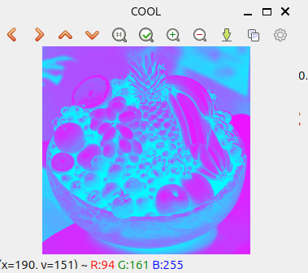

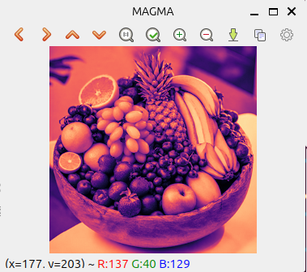

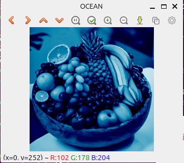

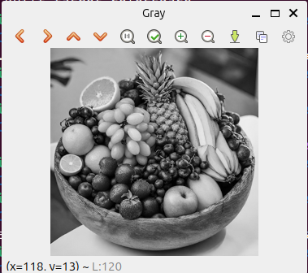

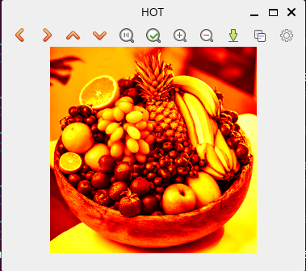

image::img/img7.png[width=300, height=300]

== Parte III - Manipulação de Imagens

=== Decomposição de Imagens em Planos de Bits

=== Enunciado
*Usando o programa bitplanes.cpp como referência para esteganografia, escreva um programa que recupere a imagem codificada de uma imagem resultante de esteganografia. Lembre-se que os bits menos significativos dos pixels da imagem fornecida deverão compor os bits mais significativos dos pixels da imagem recuperada. O programa deve receber como parâmetros de linha de comando o nome da imagem resultante da esteganografia. Teste a sua implementação com a imagem da Figura 28, “Imagem codificada” (desafio-esteganografia.png).*

=== Codificação de Bits e Planos de Bits

Em processamento de imagens, um pixel em tons de cinza é tipicamente representado por 8 bits (um `unsigned char`), permitindo 256 níveis de intensidade (0 a 255).

Podemos decompor uma imagem de 8 bits em 8 "planos de bits" separados, onde cada plano é uma imagem de 1 bit (contendo apenas 0 ou 1).

* **Plano de Bit 7 (MSB - Bit Mais Significativo)**: Contém a informação mais importante da imagem, sua estrutura e forma geral.
* **Plano de Bit 0 (LSB - Bit Menos Significativo)**: Contém a informação menos importante, geralmente parecendo ruído aleatório.

Como os bits menos significativos (LSBs), por exemplo, os planos 0, 1 e 2, têm um impacto visual quase imperceptível na imagem final, é possível *substituir* esses bits pelos bits de uma outra imagem (uma imagem secreta).

O código analisado não *cria* a esteganografia, mas sim *recupera* a imagem secreta que foi escondida nos LSBs da imagem portadora.

=== Resumo do programa

O código assume que uma imagem secreta foi escondida usando os 3 bits menos significativos (`nbits = 3`) de cada canal de cor da imagem portadora (`imagemEstego`). O objetivo é extrair esses 3 bits e usá-los para reconstruir a imagem secreta.

.recupera.cpp
[source,cpp]
----
#include <iostream>
#include <opencv2/opencv.hpp>

int main(int argc, char** argv) {
    if (argc < 2) {
        std::cout << "Uso: ./recupera esteganografia.png" << std::endl;
        return -1;
    }

    cv::Mat imagemEstego = cv::imread(argv[1], cv::IMREAD_COLOR);
    if (imagemEstego.empty()) {
        std::cout << "Imagem não carregou corretamente" << std::endl;
        return -1;
    }

    int nbits = 3; // <1>
    cv::Mat imagemRecuperada = imagemEstego.clone();
    cv::Vec3b pixelEstego, pixelRecuperado;

    for (int i = 0; i < imagemEstego.rows; i++) {
        for (int j = 0; j < imagemEstego.cols; j++) {
            pixelEstego = imagemEstego.at<cv::Vec3b>(i, j);

            // A operação principal de recuperação
            pixelRecuperado[0] = (pixelEstego[0] & ((1 << nbits) - 1)) << (8 - nbits); // <2>
            pixelRecuperado[1] = (pixelEstego[1] & ((1 << nbits) - 1)) << (8 - nbits);
            pixelRecuperado[2] = (pixelEstego[2] & ((1 << nbits) - 1)) << (8 - nbits);

            imagemRecuperada.at<cv::Vec3b>(i, j) = pixelRecuperado;
        }
    }

    cv::imwrite("imagem_recuperada.png", imagemRecuperada); // Salva o resultado
    // ... (provavelmente falta exibir a imagem, mas o núcleo é a recuperação)
    return 0;
}
----

=== Explicação da Operação de Bits

A lógica central está na linha marcada com `<2>`. Ela é executada para cada canal de cor (Azul, Verde, Vermelho) de cada pixel.

<1> **`int nbits = 3;`**: Define que a informação oculta está nos 3 bits menos significativos.

<2> **`pixelRecuperado[0] = (pixelEstego[0] & ((1 << nbits) - 1)) << (8 - nbits);`**: Esta linha complexa pode ser dividida em duas partes:

1.  **Isolando os LSBs (A Máscara):**
    * ` (1 << nbits) `: O número 1 (binário `00000001`) é deslocado 3 bits para a esquerda, resultando em 8 (binário `00001000`).
    * ` ((1 << nbits) - 1) `: Subtrai 1 de 8, resultando em 7 (binário `00000111`).
    * Este valor `00000111` é uma **máscara de bits**.
    * ` (pixelEstego[0] & 7) `: A operação `&` (AND) é usada para *isolar* apenas os 3 bits menos significativos do pixel.
    * *Exemplo:* Se o pixel portador for 173 (binário `10101101`), a operação `10101101 & 00000111` resulta em `00000101` (decimal 5).

2.  **Movendo para os MSBs (O Deslocamento):**
    * A imagem secreta foi salva usando seus bits *mais* significativos (MSBs), mas eles foram *armazenados* nos LSBs da portadora. Precisamos reverter isso.
    * ` (8 - nbits) `: Calcula `8 - 3 = 5`.
    * ` ... << 5 `: O resultado da máscara (binário `00000101`) é deslocado 5 bits para a esquerda.
    * *Exemplo:* `00000101` (decimal 5) torna-se `10100000` (decimal 160).

**Resultado:** A operação extrai os 3 bits de dados ocultos (LSBs) da imagem portadora e os move para as 3 posições de bits mais significativas (MSBs) da imagem recuperada. Isso torna a imagem secreta, que estava invisível, totalmente visível novamente (embora com alguma perda de qualidade, já que os 5 bits restantes são zerados).

=== Imagem codificada
image::img/desafio-esteganografia.png[width=300, height=300]
=== Imagem recuperada
image::img/imagem_recuperada.png[width=300, height=300]

=== Registro de Imagens

=== Enunciado
*Modifique o programa registro.cpp para que o usuário defina de forma interativa com o mouse os quatro pontos que deverão ser usados para realizar a correção de perspectiva.*

== 5. Registro e Planificação de Imagem (Transformação de Perspectiva)

Nesta seção, analisamos um código que executa o **registro** manual de uma imagem. O objetivo é corrigir a distorção de perspectiva, um problema comum quando uma foto é tirada de um objeto plano (como um documento, um quadro ou o visor de um medidor) de um ângulo, em vez de perfeitamente de frente.

O processo de corrigir essa distorção é chamado de **planificação** ou **retificação de perspectiva**.

=== O Problema da Perspectiva

Quando vemos um retângulo (como o visor do voltímetro no exemplo) em ângulo, ele não parece mais um retângulo; ele parece um trapézio.

A transformação de perspectiva é um cálculo matemático que nos permite "desfazer" essa distorção. Para isso, precisamos saber como 4 pontos (os cantos do trapézio na imagem distorcida) devem ser mapeados para 4 novos pontos (os cantos de um retângulo perfeito).

Este código permite que o usuário clique manualmente nos 4 cantos da região distorcida (`srcPoints`, ou pontos de origem) e, em seguida, calcula automaticamente o tamanho de um retângulo de destino (`dstPoints`, ou pontos de destino), gerando uma nova imagem "plana" da seleção.

=== Análise do Código (`registro.cpp`)

O código usa um callback de mouse para registrar interativamente 4 pontos de origem e, em seguida, calcula a matriz de transformação para planificar a imagem.

[source,cpp]
----
#include <opencv2/opencv.hpp>
#include <iostream>
#include <vector>

using namespace cv;
using namespace std;

vector<Point2f> srcPoints; // <1>
Mat image;

// Callback chamado a cada clique do mouse
void onMouse(int event, int x, int y, int, void *) {
  if (event == EVENT_LBUTTONDOWN) {
    if (srcPoints.size() < 4) { // <2>
      srcPoints.push_back(Point2f(x, y));
      cout << "Ponto selecionado: (" << x << ", " << y << ")" << endl;
      circle(image, Point(x, y), 5, Scalar(0, 0, 255), -1); 
      imshow("Selecione 4 pontos", image);
    }
  }
}

int main() {
  image = imread("../voltimetro.png"); // Imagem de entrada
  // ... (verificação de erro) ...

  namedWindow("Selecione 4 pontos", WINDOW_AUTOSIZE);
  setMouseCallback("Selecione 4 pontos", onMouse); // <3>

  cout << "Clique em 4 pontos na imagem na ordem: "
       << "superior-esquerdo, superior-direito, inferior-direito, inferior-esquerdo." << endl;

  imshow("Selecione 4 pontos", image);

  while (srcPoints.size() < 4) { // <4>
    waitKey(10);
  }

  // 5. Calcula as dimensões da imagem de saída
  int largura = max((int)norm(srcPoints[0] - srcPoints[1]),
                    (int)norm(srcPoints[2] - srcPoints[3]));
  int altura = max((int)norm(srcPoints[1] - srcPoints[2]),
                   (int)norm(srcPoints[3] - srcPoints[0]));

  // 6. Define os 4 cantos do retângulo de destino
  vector<Point2f> dstPoints;
  dstPoints.push_back(Point2f(0, 0));
  dstPoints.push_back(Point2f(largura, 0));
  dstPoints.push_back(Point2f(largura, altura));
  dstPoints.push_back(Point2f(0, altura));

  // 7. Calcula a matriz de transformação de perspectiva
  Mat M = getPerspectiveTransform(srcPoints, dstPoints);

  // 8. Aplica a transformação (planificação)
  Mat warpedImage;
  warpPerspective(image, warpedImage, M, Size(largura, altura));

  imshow("Imagem Original", image);
  imshow("Imagem Planificada", warpedImage);
  waitKey(0);
  return 0;
}
----

=== Explicação do Processo e Cálculos

O processo pode ser dividido em três partes:

1.  **Coleta de Pontos ( `<1>` a `<4>` )**: O código configura um `setMouseCallback` ( `<3>` ) que chama a função `onMouse` a cada clique. Esta função armazena os 4 pontos clicados pelo usuário no vetor `srcPoints` ( `<1>` , `<2>` ). O programa espera até que os 4 pontos sejam coletados ( `<4>` ).

2.  **Cálculo da Métrica ( `<5>` )**: Para criar a imagem de destino, precisamos saber suas dimensões (largura e altura). O código calcula a distância euclidiana (`cv::norm`) entre os cantos superior-esquerdo/direito e inferior-esquerdo/direito para definir a `largura`. O mesmo é feito para a `altura`.
+
A distância (norma) latexmath:[L] entre dois pontos latexmath:[P_1(x_1, y_1)] e latexmath:[P_2(x_2, y_2)] é:
+
[latexmath]
++++
L = \sqrt{(x_2 - x_1)^2 + (y_2 - y_1)^2}
++++

3.  **Cálculo da Homografia ( `<7>` )**: Este é o núcleo do processo. A função `getPerspectiveTransform` calcula uma matriz de transformação 3x3, chamada de **Matriz de Homografia** ( latexmath:[M] ).
+
[latexmath]
++++
M = \begin{bmatrix}
m_{11} & m_{12} & m_{13} \\
m_{21} & m_{22} & m_{23} \\
m_{31} & m_{32} & 1
\end{bmatrix}
++++
+
Esta matriz mapeia qualquer ponto latexmath:[(x, y)] da imagem original para um novo ponto latexmath:[(x', y')] na imagem planificada, usando as seguintes equações:
+
[latexmath]
++++
x' = \frac{m_{11}x + m_{12}y + m_{13}}{m_{31}x + m_{32}y + 1}
++++
[latexmath]
++++
y' = \frac{m_{21}x + m_{22}y + m_{23}}{m_{31}x + m_{32}y + 1}
++++
+
A função `getPerspectiveTransform` encontra os 8 valores desconhecidos da matriz (latexmath:[m_{11}]) a latexmath:[m_{32}]) resolvendo um sistema de equações lineares formado pelos 4 pares de pontos de origem (`srcPoints`) e destino (`dstPoints`).

4.  **Aplicação da Transformação ( `<8>` )**: A função `warpPerspective` finalmente usa a matriz latexmath:[M] para iterar sobre a imagem de destino (de tamanho `largura` x `altura`) e calcular, para cada pixel, de qual local da imagem original ele deve "puxar" a cor, efetivamente planificando a imagem.

=== Imagem inicial
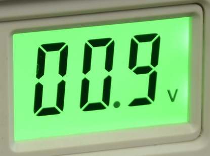
=== Imagem final
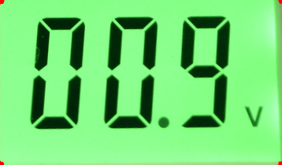

